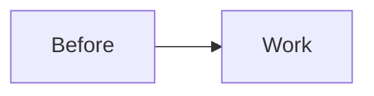
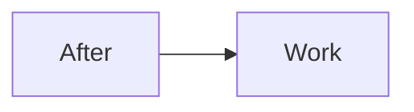

# Fixture plan

## Phase 1: Only phase

**File**: `ai/example/one.py`

#### Automated verification
- [ ] `python3 -m unittest` passes.

## Before → After

### Before

```mermaid
flowchart LR
    A[Before] --> B[Work]
```

### After

```mermaid
flowchart LR
    A[After] --> B[Work]
```
